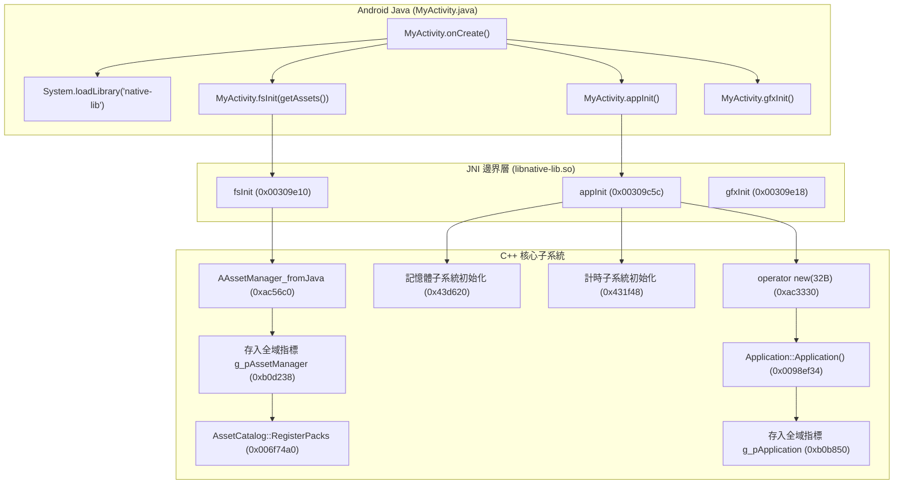
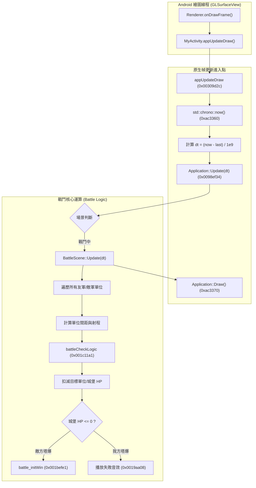
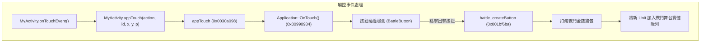

# 《貓咪大戰爭》核心調用關係圖 (CALL_GRAPH.md)

本文件以 Mermaid 流程圖與調用鏈，記錄從 Android Java 層直至 C++ 底層戰鬥與渲染之完整調用關係。

---

## 一、 主引擎生命週期與初始化調用鏈

```mermaid
flowchart TD
    subgraph Java_Layer["Android Java (MyActivity.java)"]
        J_Create["MyActivity.onCreate()"]
        J_Load["System.loadLibrary('native-lib')"]
        J_FS["MyActivity.fsInit(getAssets())"]
        J_AppInit["MyActivity.appInit()"]
        J_GLInit["MyActivity.gfxInit()"]
    end

    subgraph Native_JNI["JNI 邊界層 (libnative-lib.so)"]
        N_FSInit["fsInit (0x00309e10)"]
        N_AppInit["appInit (0x00309c5c)"]
        N_GfxInit["gfxInit (0x00309e18)"]
    end

    subgraph Native_Core["C++ 核心子系統"]
        B_AAsset["AAssetManager_fromJava (0xac56c0)"]
        G_AssetMgr["存入全域指標 g_pAssetManager (0xb0d238)"]
        P_Catalog["AssetCatalog::RegisterPacks (0x006f74a0)"]
        
        Sub_Mem["記憶體子系統初始化 (0x43d620)"]
        Sub_Timer["計時子系統初始化 (0x431f48)"]
        App_Alloc["operator new(32B) (0xac3330)"]
        App_Ctor["Application::Application() (0x0098ef34)"]
        G_App["存入全域指標 g_pApplication (0xb0b850)"]
    end

    J_Create --> J_Load
    J_Create --> J_FS
    J_Create --> J_AppInit
    J_Create --> J_GLInit

    J_FS --> N_FSInit
    N_FSInit --> B_AAsset --> G_AssetMgr --> P_Catalog

    J_AppInit --> N_AppInit
    N_AppInit --> Sub_Mem
    N_AppInit --> Sub_Timer
    N_AppInit --> App_Alloc
    App_Alloc --> App_Ctor --> G_App
```

---

## 二、 幀更新與戰鬥運算調用鏈

```mermaid
flowchart TD
    subgraph Android_Loop["Android 繪圖線程 (GLSurfaceView)"]
        GL_Draw["Renderer.onDrawFrame()"]
        J_Update["MyActivity.appUpdateDraw()"]
    end

    subgraph Native_Frame["原生幀更新進入點"]
        N_Update["appUpdateDraw (0x00309d2c)"]
        Time_Now["std::chrono::now() (0xac3360)"]
        Calc_DT["計算 dt = (now - last) / 1e9"]
        App_Update["Application::Update(dt) (0x0098ef34)"]
        App_Draw["Application::Draw() (0xac3370)"]
    end

    subgraph Battle_Subsystem["戰鬥核心運算 (Battle Logic)"]
        Scene_Route{"場景判斷"}
        Battle_Loop["BattleScene::Update(dt)"]
        Unit_Update["遍歷所有友軍/敵軍單位"]
        Range_Check["計算單位間距與射程"]
        Combat_Check["battleCheckLogic (0x001c11a1)"]
        Apply_Damage["扣減目標單位/城堡 HP"]
        Win_Condition{"城堡 HP <= 0 ?"}
        Do_Win["battle_initWin (0x001befe1)"]
        Do_Lose["播放失敗音效 (0x0019aa08)"]
    end

    GL_Draw --> J_Update --> N_Update
    N_Update --> Time_Now --> Calc_DT --> App_Update
    App_Update --> Scene_Route
    Scene_Route -->|戰鬥中| Battle_Loop
    Battle_Loop --> Unit_Update --> Range_Check --> Combat_Check --> Apply_Damage
    Apply_Damage --> Win_Condition
    Win_Condition -->|敵方塔爆| Do_Win
    Win_Condition -->|我方塔爆| Do_Lose
    Battle_Loop --> App_Draw
```

---

## 三、 輸入響應與單位生成調用鏈

```mermaid
flowchart TD
    subgraph Touch_Input["觸控事件處理"]
        A_Touch["MyActivity.onTouchEvent()"]
        J_Touch["MyActivity.appTouch(action, id, x, y, p)"]
        N_Touch["appTouch (0x0030a098)"]
        App_Touch["Application::OnTouch() (0x00990934)"]
        Btn_HitTest["按鈕碰撞檢測 (BattleButton)"]
        Spawn_Unit["battle_createButton (0x001bf6ba)"]
        Cost_Money["扣減戰鬥金錢錢包"]
        Add_To_Stage["將新 Unit 加入戰鬥舞台實體隊列"]
    end

    A_Touch --> J_Touch --> N_Touch --> App_Touch --> Btn_HitTest
    Btn_HitTest -->|點擊出擊按鈕| Spawn_Unit --> Cost_Money --> Add_To_Stage
```
